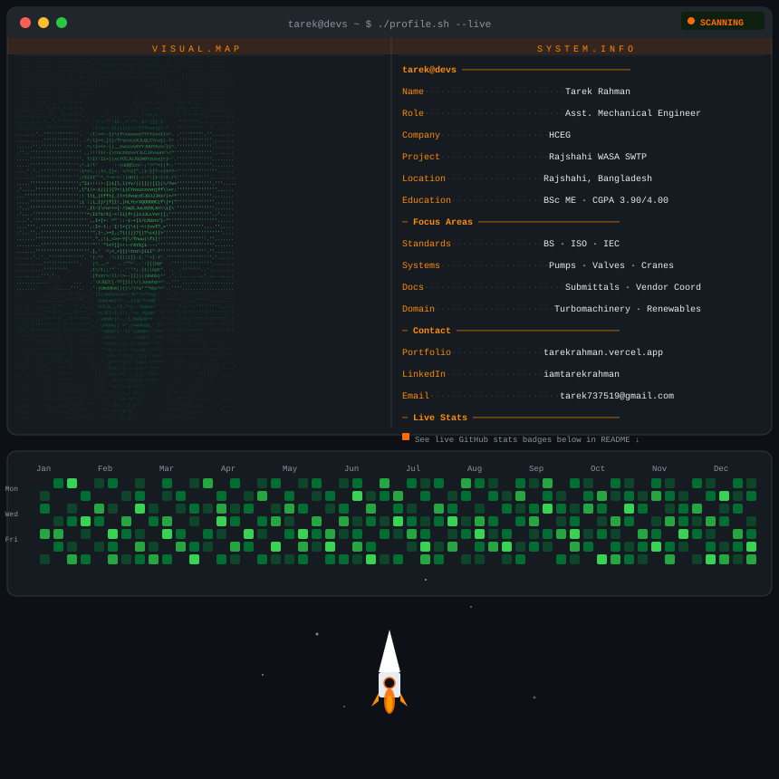

  

 

<!-- 1. Train -->

 

## ⚙️ System Access

 

<!-- 2. Gears -->

 

## 🔩 About Me

 

<!-- 3. Airplane A -->

 

## 🛠️ Tools & Technologies

  

 

<!-- 4. Pipe -->

 

## 🎓 Certifications

 

<!-- 5. Car -->

 

## 🏗️ Featured Project

 

<!-- 6. Airplane B -->

 

## 🏛️ Professional Affiliations

 

<!-- 7. Planetary Gears -->

 

## 📊 GitHub Stats

  

 

<!-- 8. Airplane C -->

 

## 🤝 Let's Collaborate

 

 

 

